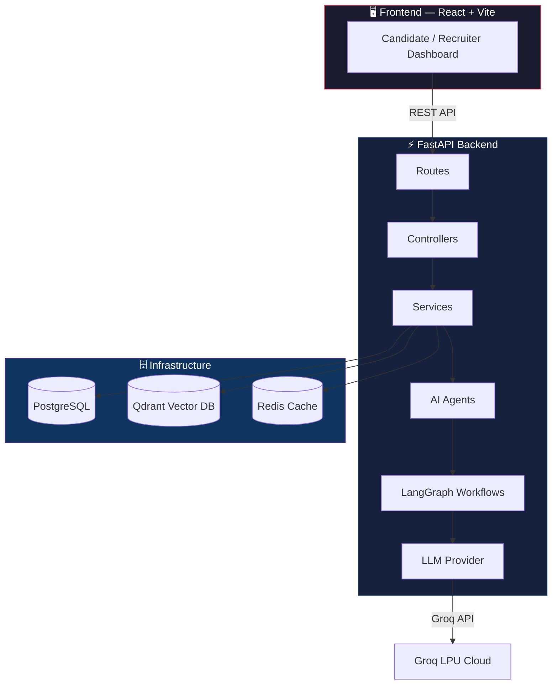
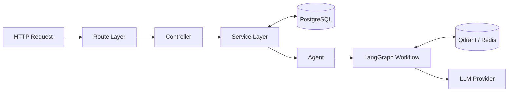
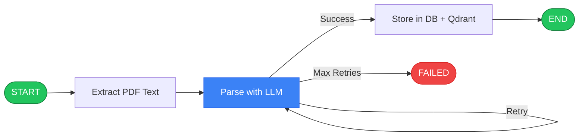
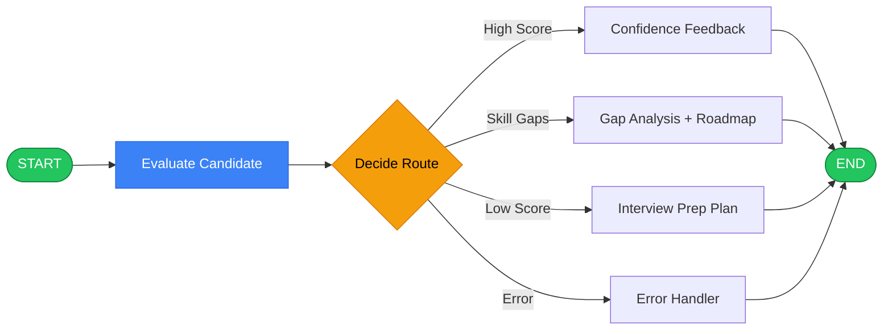
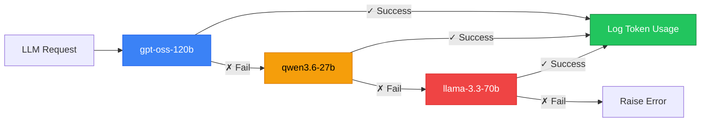

<div align="center">

# 🧠 ATS Resume Intelligence Platform

**AI-powered Applicant Tracking System that parses, evaluates, and coaches candidates using multi-agent LLM workflows.**


</div>

---

## 📋 What It Does

A production-grade, full-stack ATS platform that goes beyond simple resume parsing. It uses **6 specialized AI agents** orchestrated through **3 LangGraph state-machine workflows** to:

- **Parse** resumes from PDF with structured JSON extraction and retry logic
- **Evaluate** candidates against job descriptions using semantic similarity + LLM scoring
- **Conduct** adaptive mock interviews that adjust difficulty based on performance
- **Recommend** skill-building projects tailored to identified gaps
- **Rewrite** resumes optimized for ATS compatibility
- **Search** candidates using vector similarity across a Qdrant-powered embedding store

---

## 🏗️ System Architecture



---

## 🧩 Backend Architecture — Layer by Layer

### Request Flow



---

### 📂 Project Structure

```
app/
├── agents/                  # 6 specialized AI agents
│   ├── evaluator.py             # JD ↔ Candidate match scoring
│   ├── interview_eval_agent.py  # Adaptive mock interview engine
│   ├── jd_rewrite_agent.py      # Job description normalizer
│   ├── project_rec_agent.py     # Gap-based project recommender
│   ├── resume_parser_agent.py   # PDF → structured JSON parser
│   └── resume_rewrite_agent.py  # ATS-optimized resume rewriter
│
├── graphs/                  # LangGraph state machines
│   ├── state.py                 # TypedDict state definitions
│   ├── workflows.py             # 3 compiled graph workflows
│   ├── nodes/                   # Node functions (business logic)
│   │   ├── parser_nodes.py          # extract → parse → store
│   │   ├── self_eval_nodes.py       # evaluate → decide → branch
│   │   └── interview_nodes.py       # answer evaluation loop
│   └── edges/                   # Conditional routing logic
│       ├── parser_edges.py          # retry-or-store decision
│       └── self_eval_edges.py       # confidence/gap/interview routing
│
├── controllers/             # Request orchestration
│   ├── candidate_controller.py
│   ├── interview_controller.py
│   ├── recruiter_controller.py
│   └── resume_controller.py
│
├── services/                # Core business logic
│   ├── resume.py                # Upload, parse, deduplicate, embed
│   ├── candidate.py             # Profile management, search
│   ├── evaluation.py            # JD matching + batch scoring
│   ├── interview.py             # Stateless interview session engine
│   ├── jd.py                    # Job description normalization
│   ├── metrics.py               # Analytics & reporting
│   ├── auth.py                  # JWT authentication
│   └── ai/
│       └── vector_store.py      # Qdrant collection management
│
├── providers/               # External service adapters
│   └── llm/
│       ├── factory.py               # LLM client factory pattern
│       └── groq_provider.py         # Robust multi-model fallback client
│
├── models/                  # SQLAlchemy ORM models
│   ├── candidate.py             # Resume, CandidateProfile
│   ├── evaluation.py            # Evaluation, EvaluationResult
│   ├── interview.py             # InterviewSession, InterviewAnswer
│   ├── project.py               # ProjectRecommendation
│   ├── rewrite.py               # RewrittenResume
│   ├── rewrite_cache.py         # LLM response cache
│   └── jd_cache.py              # JD normalization cache
│
├── migrations/              # Alembic database migrations
│   └── versions/                # 6 migration scripts
│
├── routes/                  # API endpoint definitions
│   ├── compatibility.py         # Legacy flat endpoints
│   └── v1/
│       └── endpoints/
│           ├── auth.py              # POST /login, /register
│           ├── resume.py            # POST /upload, GET /list
│           ├── interview.py         # POST /start, /answer, /report
│           ├── jd.py                # POST /normalize, /evaluate
│           ├── recruiter.py         # GET /search, /candidates
│           └── health.py            # GET /health, /ready
│
├── config/                  # Application configuration
│   ├── settings.py              # Pydantic Settings (env-driven)
│   ├── database.py              # Async SQLAlchemy engine
│   ├── security.py              # JWT encode/decode, password hashing
│   └── qdrant_client.py         # Vector DB connection
│
├── prompts/                 # LLM prompt templates
│   ├── parser_prompt.txt        # Resume → JSON extraction
│   ├── evaluator_prompt.txt     # Candidate ↔ JD scoring
│   ├── interview_prompt.txt     # Question generation + evaluation
│   ├── project_rec_prompt.txt   # Gap → project suggestions
│   └── rewriter_prompt.txt      # Resume rewriting instructions
│
├── middleware/              # HTTP middleware
│   ├── request_logging.py       # Request/response logging
│   └── security_headers.py      # Security header injection
│
├── exceptions/              # Global error handling
│   ├── custom_exceptions.py     # AppError hierarchy
│   └── handlers.py              # FastAPI exception handlers
│
├── schemas/                 # Pydantic request/response models
├── constants/               # Application-wide constants
├── utils/                   # Shared utilities
│   ├── logger.py                # Loguru → stdout + application.json
│   ├── json_parser.py           # Robust LLM JSON extraction
│   ├── pdf_extractor.py         # PDF text extraction
│   └── deduplication.py         # Resume fingerprint dedup
│
├── main.py                  # FastAPI app factory
└── server.py                # Uvicorn entry point
```

---

## 🤖 AI Agents

Six purpose-built agents, each with its own prompt template and structured JSON output contract:

| Agent | Purpose | Prompt File |
|-------|---------|-------------|
| **Resume Parser** | Extracts structured data (skills, education, experience) from raw PDF text | `parser_prompt.txt` |
| **Evaluator** | Scores a candidate against a JD — returns score, 6-8 strengths, 5-7 gaps | `evaluator_prompt.txt` |
| **Interview Engine** | Generates tiered questions (Basic → Advanced → Expert), evaluates answers | `interview_prompt.txt` |
| **Project Recommender** | Suggests portfolio projects based on skill gaps | `project_rec_prompt.txt` |
| **Resume Rewriter** | Rewrites resumes for ATS optimization | `rewriter_prompt.txt` |
| **JD Rewriter** | Normalizes job descriptions into structured format | — |

---

## 🔄 LangGraph Workflows

Three compiled state-machine workflows that orchestrate agent execution with conditional branching, retry logic, and error recovery:

### 1. Resume Parser Workflow



### 2. Self-Evaluation Workflow



### 3. Interview Evaluation Workflow


---

## 🔁 LLM Provider — Robust Fallback System

The `groq_provider.py` implements a **cascading multi-model fallback** with per-call token usage logging:



**Every LLM call logs:**
- Model used, latency (ms)
- Prompt tokens, completion tokens
- Session totals and remaining TPM/TPD budget

---

## 🗄️ Database Layer

### PostgreSQL — Relational Data

Managed via **Alembic migrations** with 6 versioned migration scripts:

| Model | Table | Purpose |
|-------|-------|---------|
| `CandidateProfile` | `candidates` | Parsed profile data, skills, experience |
| `Evaluation` | `evaluations` | JD match scores, strengths, gaps |
| `InterviewSession` | `interview_sessions` | Mock interview state and history |
| `ProjectRecommendation` | `project_recommendations` | AI-suggested portfolio projects |
| `RewrittenResume` | `rewritten_resumes` | ATS-optimized resume versions |
| `RewriteCache` | `rewrite_cache` | LLM response caching |
| `JDCache` | `jd_cache` | Normalized JD caching |

### Qdrant — Vector Similarity Search

- **Model:** `BAAI/bge-large-en-v1.5` (1024-dim embeddings)
- **Collection:** `resumes` — cosine similarity
- **Use case:** Semantic candidate search by recruiter — "find candidates similar to this JD"

### Redis — Caching Layer

- Session caching, rate limiting, LLM response caching

---

## 📊 Logging & Observability

Built on **Loguru** with dual output sinks:

| Sink | Format | Purpose |
|------|--------|---------|
| `stdout` | Human-readable, color-coded | Developer terminal |
| `application.json` | Serialized JSON (10 MB rotation) | Production log aggregation |

**LLM-specific logs** include box-drawing token usage reports with TPM/TPD budget tracking.

---

## 🚀 Quick Start

### Prerequisites

- Python 3.13+
- Docker & Docker Compose
- Node.js 18+ (for frontend)

### 1. Start Infrastructure

```bash
docker-compose up -d    # PostgreSQL, Qdrant, Redis, Adminer
```

### 2. Backend Setup

```bash
python -m venv .venv
.venv/Scripts/activate          # Windows
pip install -e ".[dev]"

# Configure environment
cp .env.example .env            # Edit with your API keys

# Run database migrations
alembic upgrade head

# Start the server
uvicorn app.server:app --reload --port 3000
```

### 3. Frontend Setup

```bash
cd frontend
npm install
npm run dev
```

---

## ⚙️ Background Worker — ARQ Task Queue

Asynchronous jobs are processed by a dedicated **ARQ worker** (Redis-backed task queue) to decouple slow operations (LLM calls, embedding generation, PDF parsing) from the HTTP request lifecycle.

### Worker Architecture

```
HTTP Upload (202 Accepted)
        │
        ▼
 ┌──────────────────────────┐
 │  Resume Controller       │
 │  1. Save file to temp/   │
 │  2. Write PENDING to DB  │
 │  3. Enqueue ARQ job      │
 └──────────────────────────┘
        │
        ▼ (Redis queue)
 ┌──────────────────────────┐
 │  ARQ Background Worker   │
 │  1. Read temp file       │
 │  2. SHA-256 dedup check  │
 │  3. LLM parsing          │
 │  4. Save to PostgreSQL   │
 │  5. Generate embedding   │
 │  6. Upsert to Qdrant     │
 │  7. Send email alert     │
 │  8. Cleanup temp file    │
 └──────────────────────────┘
```

### Two Specialized Workers

| Worker Task | Handler | Purpose |
|---|---|---|
| `ingest_resume_job` | Recruiter upload flow | Full pipeline: PDF → Parse → PostgreSQL + Qdrant |
| `persist_candidate_job` | Candidate self-upload flow | Offloads only the Qdrant embedding step |

### Worker Configuration

```python
class WorkerSettings:
    functions = [ingest_resume_job, persist_candidate_job]
    max_jobs = 5      # concurrent job limit
    max_tries = 1     # no automatic retries to avoid cascading failures
    job_timeout = 630 # hard ceiling per task (seconds)
```

### Starting the Worker

```bash
just worker
# Expands to: uv run arq worker.main.WorkerSettings
```

---

## 🔁 Deduplication Strategy

Three-tier resume deduplication to prevent duplicate records and unnecessary LLM API calls:

| Tier | Check | Action |
|------|-------|--------|
| **Tier 1 — SHA-256 Hash** | Exact binary file match | Immediately skip all processing; return cached candidate |
| **Tier 2 — Plain-text Similarity** | `≥98%` cosine similarity of extracted text | Skip LLM parsing; reuse existing candidate; re-link new resume record |
| **Tier 3 — Identity Match** | Email or (Name + Phone) match in PostgreSQL | Update existing candidate profile fields, re-index Qdrant vector if fields changed |

### Safe Cascade Deletion
When an existing candidate uploads a new version of their resume, the system:
1. Reassigns the `Candidate.resume` relationship to the new `Resume` object (not just the FK integer)
2. Explicitly severs `old_resume_rec.candidate = None` before deleting the old record
3. This prevents SQLAlchemy's `cascade="all, delete-orphan"` from cascading and deleting the active `Candidate` row

---

## 📧 Email Alerting — Mailtrap SMTP

An asynchronous HTML email alert is sent after every background worker task completion.

- **Provider:** Mailtrap Sandbox SMTP (`sandbox.smtp.mailtrap.io`)
- **Trigger:** After every `ingest_resume_job` (success or failure)
- **Recipient:** Admin email configured via `MAIL_ADMIN_EMAIL` env variable
- **Dispatch:** Runs via `asyncio.run_in_executor` so it never blocks the worker coroutine

### Email Environment Variables

| Variable | Description |
|----------|-------------|
| `MAIL_HOST` | SMTP hostname (`sandbox.smtp.mailtrap.io`) |
| `MAIL_PORT` | SMTP port (`2525`) |
| `MAIL_USERNAME` | Mailtrap inbox username |
| `MAIL_PASSWORD` | Mailtrap inbox password |
| `MAIL_FROM_EMAIL` | Sender address shown in the email |
| `MAIL_ADMIN_EMAIL` | Destination alert email address |

---

## 🛡️ Production Middleware Stack

The `app/main.py` lifespan startup validates infrastructure before accepting any traffic:

```
Startup Sequence
│
├── 1. PostgreSQL connection check (SELECT 1)
├── 2. Qdrant collection initialization
├── 3. GROQ_API_KEY validation
└── 4. Global Redis pool initialization (ARQ)
```

Middlewares applied to every request (in order):

| Middleware | Library | Purpose |
|---|---|---|
| **Rate Limiting** | SlowAPI | Per-IP request rate limiting backed by Redis |
| **CORS** | FastAPI CORSMiddleware | Cross-origin resource sharing headers |
| **GZip Compression** | Starlette GZipMiddleware | Compresses responses > 1000 bytes |
| **Security Headers** | `secure` (Helmet equivalent) | CSP, HSTS, X-Frame-Options, etc. |

### Rate Limiter (`app/config/rate_limiter.py`)

```python
limiter = Limiter(
    key_func=get_remote_address,
    storage_uri=f"redis://{settings.redis_host}:{settings.redis_port}/1"
)
```

---

## 🧰 Justfile Commands

All development workflows are managed via [`just`](https://github.com/casey/just):

```bash
just dev          # Start FastAPI server (uvicorn, port 8000, hot reload)
just worker       # Start ARQ background worker
just venv         # Spawn a new shell with .venv activated (Windows)
just migration    # Auto-generate Alembic migration (usage: just migration "msg")
just migrate      # Apply all pending migrations (alembic upgrade head)
just seed         # Seed the database with sample data
just lint         # Run Ruff linter
just format       # Run Ruff formatter + linter checks
just sonar        # Run SonarQube analysis
just docker-up    # Start all Docker containers (PostgreSQL, Qdrant, Redis, Adminer)
just docker-down  # Stop and remove all containers
just docker-logs  # Tail container logs
just docker-ps    # List running containers
```

---

## 🔧 Environment Variables

| Variable | Description | Default |
|----------|-------------|---------|
| `DATABASE_URL` | PostgreSQL connection string | — |
| `GROQ_API_KEY` | Groq API key for LLM inference | — |
| `QDRANT_URL` | Qdrant server URL | `http://localhost:6333` |
| `REDIS_HOST` | Redis hostname | `localhost` |
| `REDIS_PORT` | Redis port | `6379` |
| `JWT_SECRET_KEY` | JWT signing secret | dev default |
| `LLM_FALLBACK_MODELS` | Comma-separated model fallback chain | `openai/gpt-oss-120b,qwen/qwen3.6-27b,llama-3.3-70b-versatile` |
| `LLM_BASE_URL` | Custom LLM endpoint URL | Groq default |
| `MAIL_HOST` | SMTP hostname for email alerts | `sandbox.smtp.mailtrap.io` |
| `MAIL_PORT` | SMTP port | `2525` |
| `MAIL_USERNAME` | SMTP auth username | — |
| `MAIL_PASSWORD` | SMTP auth password | — |
| `MAIL_FROM_EMAIL` | Sender address for alerts | — |
| `MAIL_ADMIN_EMAIL` | Admin email to receive worker alerts | — |

---

## 🧪 Testing

```bash
pytest tests/ -v --cov=app
```

## 🛡️ Code Quality & Security (SonarQube)

This project integrates **SonarQube** for automated code quality gates, code smell detection, and security hotspot analysis. I actively maintain clean code standards and have resolved major security hotspots:

### 🔒 Key Security Fixes
* **Catastrophic Backtracking (ReDoS) Prevention ([S5852](https://rules.sonarsource.com/python/RSPEC-5852)):** 
  I replaced vulnerable regular expressions used in email parsing with a secure, linear-complexity token scanner (`_scan_email_tokens`) utilizing string splits and character strip operations. This completely eliminates the risk of Denial of Service (DoS) attacks via backtracking.
* **Cognitive Complexity Reduction ([S3776](https://rules.sonarsource.com/python/RSPEC-3776)):**
  Refactored deeply nested loops and helper functions inside the resume service into modular static helper methods (`_is_valid_email`, `_scan_email_tokens`), keeping cognitive complexity scores well below SonarQube's strict limits.

### ⚙️ Running Analysis
To run a local SonarQube quality analysis scan:
```bash
just sonar
```

---

## 📦 Tech Stack Summary

| Layer | Technology |
|-------|-----------|
| **Runtime** | Python 3.13, `uv` package manager |
| **API Framework** | FastAPI + Uvicorn |
| **AI Orchestration** | LangGraph (state machine workflows) |
| **LLM Inference** | Groq Cloud (GPT-OSS, Qwen, LLaMA) |
| **Embeddings** | SentenceTransformers (`bge-large-en-v1.5`) |
| **Vector DB** | Qdrant (cosine similarity search) |
| **Relational DB** | PostgreSQL 16 + SQLAlchemy 2.0 |
| **Migrations** | Alembic |
| **Task Queue** | ARQ (Redis-backed async background jobs) |
| **Caching / Queue** | Redis 7 |
| **Email Alerts** | Mailtrap SMTP (sandbox) |
| **Rate Limiting** | SlowAPI + Redis storage |
| **Security Headers** | `secure` (Helmet equivalent) |
| **Auth** | JWT (python-jose) + Argon2 password hashing |
| **Logging** | Loguru (structured JSON + console) |
| **Linting** | Ruff |
| **Task Runner** | Just (justfile) |
| **Frontend** | React 18 + Vite + TailwindCSS |
| **Infrastructure** | Docker Compose |

---

## 📄 License

This project is licensed under the MIT License — see the [LICENSE](LICENSE) file for details.

---

<div align="center">
  <sub>Built with ❤️ by <a href="https://github.com/nakul-cloud">Nakul Jadhav</a></sub>
</div>
